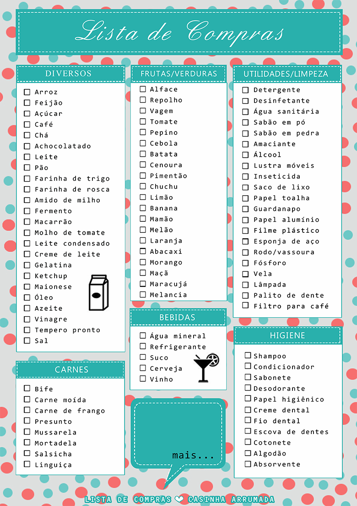

<h1 align="center"> To-Buy </h1>

Solução de lista de compras para uso pessoal básico. 

  <a href="#-tecnologias">Tecnologias</a>&nbsp;&nbsp;&nbsp;|&nbsp;&nbsp;&nbsp;
  <a href="#-projeto">Projeto</a>&nbsp;&nbsp;&nbsp;|&nbsp;&nbsp;&nbsp;
  <a href="#memo-licença">Licença</a>

  

 

  

## 🚀 Tecnologias

Esse projeto foi desenvolvido com as seguintes tecnologias:

- HTML e CSS
- JavaScript
- Git e Github
- Vscode

## 💻 Projeto

To-buy é um app criado para facilitar compras em supermercado e diminuir o uso de papel.

## 🔍 Prévia

Uma prévia desse projeto se encontra em: https://evan-bru.github.io/to-buy/

##  📝 Licença

Esse projeto está sob a licença MIT.

---

Feito com 💙 by Evan-Bru 💪

*Futuras atualizações, adicionar tela de login com senha.
